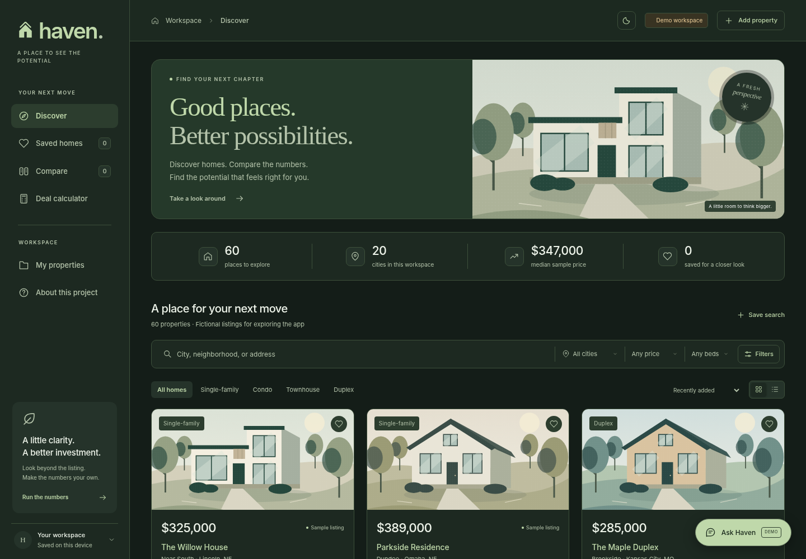

# Haven

**Good places. Better possibilities.**

A real-estate discovery and investment-analysis workspace built with TypeScript, CSS, and native browser APIs. Explore a property, compare the numbers, model a scenario, and save a decision.

This is a working local-first portfolio prototype, not a live listing service. All 60 starter properties across 20 cities use fictional addresses, neighborhood labels, prices, rents, and costs. The default interest rate is illustrative, not a current quote. There is no account system or live MLS integration. A backend is not required; an optional server-side AI interpreter is included for explicit opt-in use.



## What changed in 1.3

**Ask Haven now answers data-comparison requests immediately.** “Cheapest house,” “the biggest place,” “most bedrooms,” “something affordable,” and other supported criteria filter and rank the entire 60-listing catalogue without a required city, budget or questionnaire. Cards and the answer name the winner, report actual fixture numbers, explain the sort order and scope, and disclose ties. Subsequent filters and “Show more matches” keep the same ranking. Price, area, beds, baths, year built, HOA, tax, insurance, sample rent, price per square foot and explicitly labeled model-derived metrics are supported.

“Affordable” is explicitly interpreted as lowest asking price, not a personal affordability judgment. “Best value” is explicitly interpreted as lowest asking price per square foot, not an investment recommendation. “House” narrows to single-family; “home” or “place” includes all property types. Exact and maximum physical constraints and references such as “cheaper than The Willow House” are also recognized. Genuinely subjective or competing requests receive a targeted clarification rather than a mandatory city question. Unrecorded information, including distances to downtown, is never fabricated.

**The whole application now has light, dark and system appearances.** Open the sun/moon control in the header to choose **Light**, **Dark**, or **Use device setting**. The light theme keeps the airy white design; the dark theme uses forest-charcoal surfaces, soft sage accents and warm high-contrast text. Every page, dialog, input, autocomplete, chart, table, toast and chat panel uses semantic color tokens. The setting is applied before the app renders, follows device changes in system mode, and never resets chat, filters or calculator edits. Browser-permitted persistence uses a separate appearance key. See [theme behavior and scope](docs/THEMES.md).

No listing numbers, original IDs, workspace backup format or financial formulas were changed. All comparisons work in the self-contained local demo with no API key. Known comparisons remain deterministic even with optional connected AI enabled. The offline parser is deliberately bounded, not a general-purpose language model; see [assistant behavior and limits](docs/ASSISTANT.md).


## What changed in 1.2 (previous release)

**Ask Haven** is a clean, persistent chat widget available on every page. It asks about purchase budget, city, home type and must-haves, then recommends up to three existing demo homes with specific reasons tied to their fixture data. Users can refine their search conversationally, request more matches, open details, run the numbers and save homes directly from chat. Unsupported amenities are labeled unverified; impossible searches never silently stretch the budget. Chat survives navigation and closing, but clears on refresh.

The standalone app runs immediately with an explicitly labeled **local demo matcher**, not a live language model. The source also includes an optional **server-side live-AI connection**, disabled by default. See [assistant behavior, AI setup and privacy](docs/ASSISTANT.md). No API key is embedded in the downloadable app or required to try it.

**The calculator property picker is now searchable.** Type a name, city or type and see results update on every keystroke. Suggestions show an illustration, price, location and specifications. Mouse/touch selection, arrow keys, Enter, Escape, clearing, empty states and focus restoration are implemented. Demo and custom properties are included; typing alone does not change the current scenario.

The palette, illustrations, name, original 60 fixtures, saved IDs, backup format and calculation model remain unchanged. Both new components have restrained motion and respect reduced-motion preferences.


## What changed in 1.1 (previous release)

The same clean visual system, with a larger sample world and subtle motion:

- **60 fictional properties in 20 cities**, up from 12 in four cities. New examples include Chicago, Austin, Raleigh, Seattle, Portland, and San Diego. All four property types have at least 12 examples.
- **Progressive browsing in groups of 12.** “Show more” appends cards without rebuilding existing ones, moves focus to the first new home, and updates a visible progress indicator. Search, filters, sorting, saved homes, comparisons, notes, and the calculator operate on the complete catalog, not just loaded cards.
- **Finite, lightweight motion.** Landing-page reveals, on-scroll staggered cards, card/image hover effects, heart feedback, dialog entrances, filter expansion, and the comparison tray. No animation library or infinite decorative loops. Reduced-motion preferences are respected, including changes during a session.
- **Compatible backups.** Original property IDs and financial inputs remain unchanged. Export a JSON backup from the old version and import it through **Your workspace** in the updated version to transfer saved homes, notes, and scenarios between file locations.

The new illustrations use the same palette and style, with additional townhome, duplex, and low-rise facades. No live listing service or new network dependency has been added.

## Start in under a minute

You need Node.js 20 or newer for the local server. The archive includes the compiled app, so **no dependency installation is needed just to run it**.

```bash
cd haven
npm start
```

Open `http://localhost:3000` in your browser. Keep the terminal running; press Ctrl+C to stop. Set the `PORT` environment variable when port 3000 is already in use.

The fully bundled version is at `http://localhost:3000/dist/index.html`. It is also distributed separately as `Haven.html`: one file containing the application, styles, and original illustration code. Open that file in a modern browser for a quick look. Browser handling of local-file storage varies, so use the local server or a static HTTPS deployment for reliable workspace saving.

No API key, database configuration, remote script, or external font is required for the local demo. Live AI is optional and needs the server described in [the assistant guide](docs/ASSISTANT.md).

## What actually works

| Area | Implemented behavior |
| --- | --- |
| Assistant | Persistent widget, multi-turn preference collection, catalogue-grounded recommendations, explanations, refinements, saving, details, calculator actions, explicit local/live mode labeling. |
| Calculator search | Per-keystroke suggestions across all demo and custom properties, keyboard navigation, illustrated options and safe selection/restore behavior. |
| Discovery | Live search; city, budget, bedroom, area, cash-flow and property-type filters; five sort options; progressive loading; grid/list layouts; empty states; named saved searches. |
| Saved homes | Save and remove homes, review a saved-only view, and write explicit-save notes in a property detail dialog. |
| Comparison | Select up to three properties, remove or clear selections, compare consistent baseline metrics, and export CSV. |
| Deal calculator | Live fixed-rate financing, cash flow, cap rate, cash-on-cash return, upfront cash, expense breakdown, rent/rate sensitivity, loan-balance chart, and annual amortization. |
| Scenarios | Change financing and operating assumptions, use presets, save named snapshots, reload them, delete them, and export a detailed report. |
| Your properties | Add, edit and delete custom entries with validated inputs. Deletion also cleans associated saved state. |
| Workspace | Browser-local persistence, JSON export, validated import with replacement confirmation, and reset with confirmation. |
| Resilience | Session-only warning when storage fails; corrupt-data recovery; invalid-input states; optional-photo fallback; CSV escaping; user text rendered as text. |

The mobile layout includes a navigation drawer. Native dialogs support Escape and focus management. Inputs have labels, tables have captions or headings, feedback uses live regions, and animations respect reduced-motion preferences. These are implemented accessibility features, **not a claim of complete accessibility certification**.

### Try this demo flow

1. Filter Discover to Lincoln and save a named search.
2. Open The Willow House, add a note, and save the home.
3. Compare it with two other properties, then export the comparison.
4. Choose **Run the numbers**, switch to **All cash**, or change rent and vacancy. Save the scenario and export the report.
5. Add your own property. Export a workspace backup, reset, and import the backup to restore it.

## Editing the project

The running app has zero third-party runtime dependencies. TypeScript is the sole npm development dependency, pinned to the compiler version used for this build.

```bash
npm install
npm run build
npm test
npm start
```

`npm run build` compiles strict TypeScript into `build/`, then creates the portable `dist/index.html`. Run it after source changes. `npm test` runs tests against the compiled modules, so rebuild first when editing TypeScript. `npm run typecheck` checks source without emitting files.

The included build output lets a reviewer run the original app and unit tests before installing the compiler. No lockfile is included in this generated archive; generate and commit one with `npm install` when setting up your repository.

### Structure

```text
src/
  types.ts          Typed domain models, assumptions, filters, and workspace schema
  finance.ts        Pure calculations, amortization, validation, filtering, sorting
  data.ts           60 clearly fictional starter properties across 20 cities
  storage.ts        Workspace persistence, import validation, limits, recovery
  ui.ts             Escaping, formatting, icons, original architectural SVG artwork
  theme.ts          System/light/dark appearance, prepaint choice and menu
  ranking.ts        Typed numeric query operators and deterministic tie-breaking
  motion.ts         Observer-driven reveals, Web Animations, reduced-motion support
  property-search.ts Pure, token-based property option search
  property-picker.ts Accessible calculator combobox and selection behavior
  assistant-engine.ts Typed preference parsing, filtering, ranking and explanations
  assistant-widget.ts Persistent chat interface, actions and optional AI mode
  views.ts          Discovery, saved, compare, property details, and workspace views
  calculator.ts     Calculator inputs, results, sensitivity, and loan visualizations
  app.ts            Application state, navigation, event handling, dialogs, exports
  styles.css        Responsive visual system and interaction states
scripts/
  build.mjs         Small static-module bundler for the known application graph
  serve.mjs         Local-only development server and guarded optional AI routes
  ai.mjs            Server-side structured-output interpreter; no browser credentials
build/              Precompiled ES modules, also used by unit tests
dist/index.html     Self-contained distribution file
tests/              Node unit tests and four Python Playwright browser suites
docs/               Screenshots, formulas, test results, and portfolio guidance
```

Pure business logic is separated from rendering and persistence. This makes the calculations independently testable and makes a future UI-framework or storage migration possible without rewriting the model.

The bundler deliberately supports only this project's known static named-import/export graph. It is not a general JavaScript bundler. Use a general-purpose bundler before introducing dynamic imports, complex module syntax, or a large dependency graph.

## Model and data boundaries

Every result is conditional on editable inputs. Defaults are 20% down, 6.5% illustrative interest, a 30-year loan, 5% vacancy, 5% maintenance, 8% management, 3% capital reserve, and 3% closing costs. Property fixtures supply price, rent, tax, property insurance and HOA. Initial repairs and mortgage insurance default to zero; add any applicable amounts yourself.

Net operating income excludes financing and capital reserves. Cash flow subtracts both, plus entered mortgage insurance. Management uses rent after vacancy; maintenance and capital reserves use gross scheduled rent. Initial cash includes down payment, closing costs and initial repairs.

See [the model specification](docs/MODEL.md) for exact formulas and a reproducible example. The app does not estimate appreciation, tax benefits, future rent increases, selling costs, adjustable-rate loans, eligibility, legal compliance, or lender-specific requirements. It is not financial advice.

## Persistence and privacy

Appearance is stored separately under `haven.appearance.v1`; it is not part of workspace backups. Workspace data is stored in this browser under `haven.workspace.v1`. Saved homes, comparison selections, custom properties, notes, named searches, and saved scenarios are included. Unsaved calculator edits, current navigation, sort/layout controls, and temporary filters are not a cross-session workspace record.

There is no sign-in, analytics, cloud workspace upload, cloud synchronization, or encryption of your notes. The assistant uses tab memory, not workspace storage; an opt-in live-AI session sends chat text and recognized preferences to the configured provider through the local server, but never workspace notes, scenarios or backups. Do not treat browser storage as a secure document vault. Other devices and browser profiles do not share the workspace. Clearing site data removes it, so export backups regularly. Imports replace rather than merge the workspace, after validation and explicit confirmation.

Limits include 500 custom properties, 50 saved searches, 100 saved scenarios, three comparison slots, and a 3 MB import file limit. These are prototype guardrails, not a tested maximum-scale performance guarantee.

If storage is denied or unavailable, the app continues in memory and shows a warning with a backup option. Browser behavior for `file:` URLs is not standardized for localStorage; serve over localhost or HTTPS. See [MDN's localStorage documentation](https://developer.mozilla.org/en-US/docs/Web/API/Window/localStorage).

Original architectural SVG artwork is the default and works without a network. The optional photograph setting in About requests illustrative images from Unsplash. Those images are not photographs of the fictional properties; enabling them sends normal image requests to a third party. A failed request falls back to the original artwork. No external font files are included.

## Verification

The supplied build passed **189 Node unit/server tests and 298 Chromium browser checks** (77 original workflows, 36 catalog/motion checks, 81 assistant/picker checks and 104 ranking/theme checks). The new browser suite includes 29 rendered-text contrast sample groups across both themes; this is not a full accessibility audit. The browser run used an isolated document with an in-memory Storage adapter because native navigation/storage were restricted in the build environment. App state restoration and denied-storage handling were exercised; native cross-session localStorage, direct-file opening, Firefox and Safari were not verified here. Provider requests use mocks in the automated tests; live OpenAI responses with a real key were not tested. The server's actual local HTTP endpoints, asset allowlist and request gates were checked without contacting OpenAI.

See [testing instructions and scope](docs/TESTING.md), [unit results](docs/unit-test-results.txt), the [machine-readable browser results](docs/browser-test-results.json), [catalog/motion results](docs/catalog-motion-results.json), [assistant/picker results](docs/assistant-browser-results.json), and [ranking/theme results](docs/ranking-theme-results.json). No test-coverage percentage or production-readiness claim is implied.

## Publish

Upload **only `dist/index.html`** as the root `index.html` of a static site. No runtime build command or backend is necessary for the prebuilt local-demo artifact. Optional live AI requires a separately secured server; a static upload does not activate it. Keep your source, README and tests in a separate public repository. This archive has not been deployed on your behalf.

The included local server is a development convenience, not a production server. For a configured strict Content Security Policy, account for the bundled inline scripts/styles and data-URI SVG images, or split them into external build assets and use suitable hashes/nonces. Do not simply disable an existing site's security policy.

## Make it a portfolio project

The strongest story is the complete decision workflow, not simply a house-card UI. Explain the financing assumptions, edge cases, import validation, failed-storage behavior and tests. See [portfolio guidance](docs/PORTFOLIO.md) for alternative real-estate concepts, a demo outline, and a next-step extension. Treat this as a starting codebase: understand it, make substantive changes, and describe your contribution accurately.
