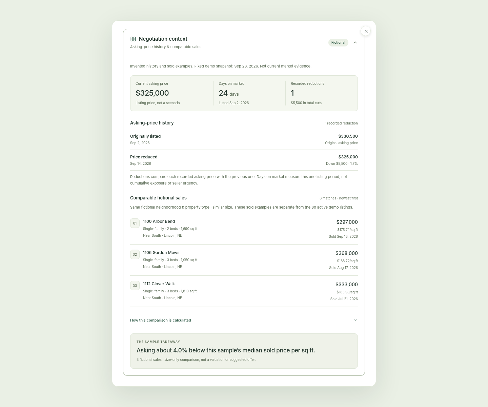
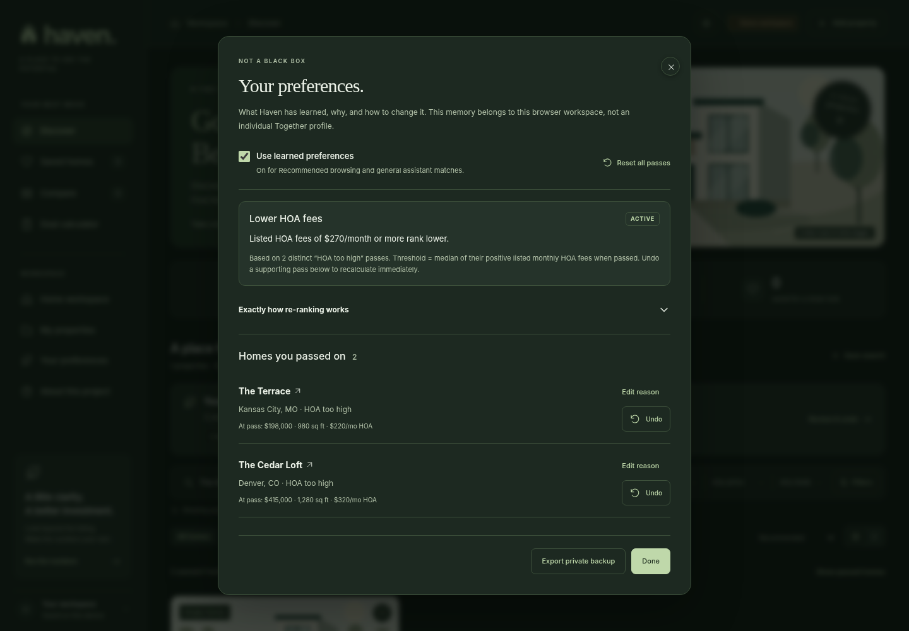
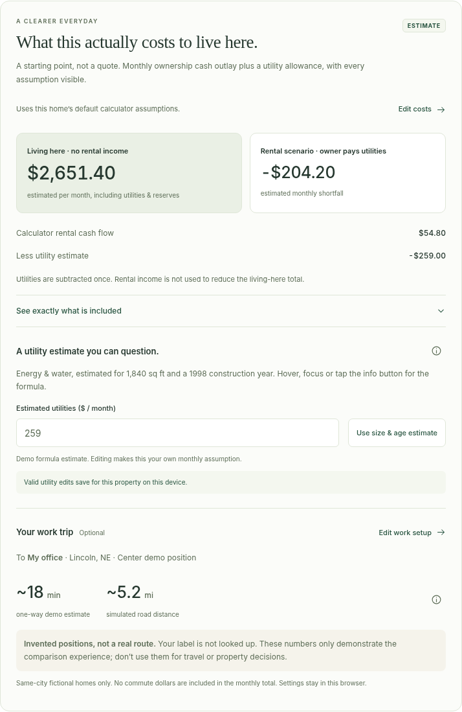
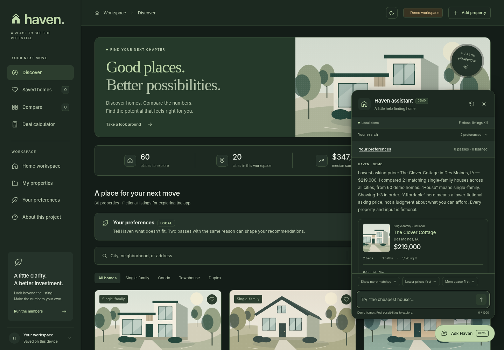
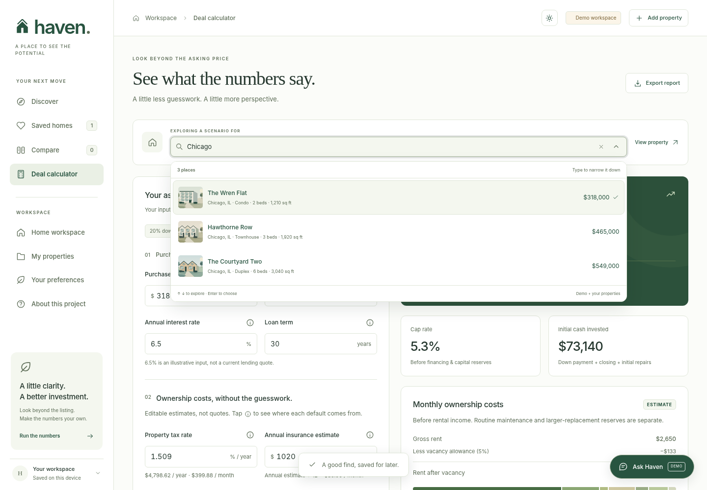

# Haven

**Find your home. Understand your next move.**

A home-decision workspace built with TypeScript, CSS, and native browser APIs. Explore a home, see what life there would cost, compare household priorities, and prepare better tour questions.

This is a working local-first portfolio prototype, not a live listing service. All 60 starter properties across 20 cities use fictional addresses, neighborhood labels, prices, rents, and costs. The default interest rate is illustrative, not a current quote. There is no account system or live MLS integration. A backend is not required; an optional server-side AI interpreter is included for explicit opt-in use.



## What changed in 1.8 (current release)

**Feature #4: inspectable negotiation context.** All four requested decision-support features are now implemented in the local demo; the earlier calculator, living-cost and reversible preference features are preserved.

Open a property’s details and expand **Negotiation context**. It sits above the living-cost section and starts collapsed to preserve the simple page.

- **Dated asking-price history.** See days on market, original asking price, each recorded price change, and any reductions. No-cut homes explicitly say so. All dates refer to the prominently labeled **September 26, 2026 fictional snapshot**, not a live clock or market feed.
- **Three to five comparable fictional sales per demo home.** Separate sold examples show address, property type, bedrooms, square footage, sold price, price per square foot, and sold date. The original 60 active listings are unchanged; 240 read-only sold fixtures are supporting context, not more search results.
- **One computed takeaway, not a stored verdict.** Compare asking price per square foot with the median of individual comparable-sale ratios. Both above- and below-sample outcomes are shown neutrally. A calculator what-if cannot rewrite the listing price or sales data.
- **Inspect the method.** The expandable explanation shows exact type/neighborhood, size, bedroom and recency criteria; the formula and values; stable selection; and missing adjustments. “Nearby” is a shared fictional neighborhood label, not a distance claim. This is not a valuation, suggested offer or claim about seller motivation.
- **Missing evidence stays missing.** Custom homes receive a clear no-data state. Fewer than three usable matches means no percentage verdict; criteria are not widened to manufacture a result.
- **Read-only and local.** No new storage fields, migration, network call, account, API key or live AI is needed. Existing research and financial inputs are not changed. Native keyboard disclosures, both themes and reduced motion are retained; a discovered contrast defect on the existing custom-property badge is also fixed.

**Verified:** 546 unit/server tests and 1,051 Chromium browser assertions, zero failures (87 new unit tests and 166 new browser assertions). See [current counts and limits](docs/TESTING.md). Read [the exact source, selection rules, formula and review checklist](docs/NEGOTIATION.md). The complete app remains a clearly fictional educational prototype, not market intelligence for real homes.

## What changed in 1.7 (previous release)

**Feature #3 only: rejection memory with transparent, reversible re-ranking.** Features #1 and #2 are preserved. Negotiation intelligence (#4) remains pending review.

- **A distinct “Not interested” action.** Available on cards, property details, and assistant recommendations. A keyboard-accessible reason picker offers Too far, HOA too high, Too small, Price too high, and Other with required free text. Context and method details can be expanded without cluttering the quick picker. Nothing is recorded until you confirm.
- **Learn from comparable evidence, not surveillance.** After two distinct, usable passes with the same reason, a soft rule is derived from the median of those listing values. Duplicate passes on one home count once. No guesses from views, saves, budgets, demographics, or free-text notes.
- **Actual re-ranking.** Discover's new **Recommended** order and general assistant matches prefer fewer learned conflicts. Each active trait has equal weight; ties preserve the original order. Explicit filters stay hard constraints. “Cheapest,” “biggest,” and the other numerical sorts retain their real data order among unpassed matching homes.
- **Show your work.** A compact **Your preferences** panel names learned traits. The full panel shows exact thresholds, evidence counts, pending reasons, pass history, the complete ranking method, and one-click undo. Pause learning without losing history, edit a reason, or reset all passes after confirmation. Restoring evidence changes the ranking immediately.
- **No lost research.** Passing hides a home from new recommendations, not your saved list, comparisons, notes, financial plans, or tour research. Show passed homes in Discover or review them from the history. Feedback changes do not replace incomplete calculator/household inputs. The memory is workspace-wide, not a secure or private Together profile.
- **Honest distance limits.** Too far only learns from the same fictional commute setup. Missing/custom/outside-city distances and changed work positions do not become invented route preferences. “Other” is context only. Source listing amounts—not calculator what-ifs—form the evidence.
- **Local and portable.** The existing storage key, validated backup/import flow, deletion cleanup, and session-only warnings are reused. Older backups start with empty memory. Full backups contain rejection notes and existing personal data; keep them private. No key, API request, or live model is required. Structured feedback is not attached to the optional AI interpreter.

**Verified:** 459 unit/server tests and 885 Chromium browser assertions, zero failures. Added 90 unit tests and 184 browser assertions. Both themes, 320–1440px grid/list layouts, keyboard controls and reduced motion are covered. Browser persistence is simulated, not native cross-session storage. See [the exact algorithm and limitations](docs/PREFERENCES.md) and [testing scope](docs/TESTING.md).



## What changed in 1.6 (previous release)

**Feature #2 only: What this actually costs to live here.** Open any property's details for a new cost-of-living section. Feature #1 remains intact; rejection learning (#3) and negotiation intelligence (#4) are **not** implemented yet.

- **Same saved calculator plan.** The section reads each home's last valid tax, insurance, financing, maintenance, HOA and reserve inputs. It shows the calculator's rental cash flow and a utility-adjusted rental result separately from an owner-occupant monthly cash-outlay total. Living in a home does not imply collecting its full rental income. Closing and other one-time costs stay out of monthly totals.
- **Open utility assumptions.** A labeled demo formula uses square footage and construction year. Hover, focus or tap for the complete formula, coefficients and limitations. Enter your own monthly amount or reset to the formula; valid edits save independently for each home. Blank or invalid edits are marked unsaved/stale, not silently treated as zero.
- **One optional work setup.** Under **Your workspace → Work location & commute**, choose no estimate, work from home, or an explicitly fictional commute. Set a location label, demo city, invented grid position and assumed speed once. Same-city fictional homes show transparent one-way demo time/distance; other-city and custom entries show no estimate rather than invent a route. No address is geocoded and these are **not real routes**. Commute dollars are not included in the monthly total.
- **Local and reversible.** Older backups migrate safely, new settings export/import with the workspace, and denied storage has visible session-only behavior. Financial snapshots and the separate Your Life Here household budgets are not rewritten. No work or utility data is attached to AI requests. Full backups may contain a work label and should be kept private.

The new UI uses the existing complete light/dark palettes, reduced-motion rules and mobile styles. No API key, live AI, mapping service, external calls or additional listing data was added. All 60 fixture records are unchanged.

**Verified:** 369 unit/server tests and 701 Chromium browser assertions, zero failures. The additions are 70 unit tests and 165 browser assertions. Browser storage is simulated; no native cross-session persistence or complete accessibility certification is claimed. See [feature details and formulas](docs/LIVING-COSTS.md) and [testing scope](docs/TESTING.md).



## What changed in 1.5 (previous release)

**Feature 1 of 4: transparent cost breakdown.** The existing Deal calculator now explains where its numbers come from. This release stops here for review; it does not add the proposed property-detail living-cost section, commute estimates, rejected-property learning, or negotiation/comparable-sales panel.

- Independently edit annual property tax rate, annual insurance, routine maintenance (monthly dollars or annual % of purchase price), applicable monthly HOA, and one-time closing costs (% or dollars).
- Every numeric calculator field has a keyboard-, hover-, and tap-accessible **why this default** explanation. Defaults come from fictional records or existing illustrative allowances, not claims about national averages or current quotes. Tax rates are derived from the sample annual amount and rounded to 0.001 percentage point for new plans.
- Valid edits recalculate immediately and save per home under the existing workspace key. Switching home, navigating away, reinitializing with saved storage, or restoring a full backup brings the plan back. Invalid entries leave the last valid result visibly stale and do not overwrite the saved plan. Storage failure is explicitly session-only.
- Switching maintenance or closing units preserves the dollar amount. Turning HOA off hides/disables its input and excludes the fee; turning it back on restores the entered amount. Reset affects only the current home.
- **Monthly costs and reserves**, **cash needed upfront**, and **first-year cash outlay** have separate, explicit scopes. Closing is counted once, never as a monthly charge. First-year outlay includes down payment and loan principal (equity), and reserves (set-asides); it is not an estimate of economic loss or a complete living-cost budget.
- Saved scenarios remain frozen, older scenarios keep their original initial dollar results when opened, and new CSV reports include the effective units and amounts. Full backups include calculator plans. The existing Home workspace budget remains a separate plan; calculator changes do not silently overwrite it or the standard listing/Compare/assistant assumptions.

Start at **Deal calculator → Ownership costs, without the guesswork**. Try changing closing costs: upfront cash should change, but monthly cost should not. Then try a different insurance estimate and switch between two homes. See [cost breakdown behavior, formulas, defaults, and review checklist](docs/COST-BREAKDOWN.md).

No new API, account, mapping service, or external network call is required. Live AI remains unconfigured. All 60 fictional listings, theme choices, reduced-motion behavior, and the previous decision workspace are retained.

## What changed in 1.4 (previous release)

**One home. Three perspectives.** Choose **Home workspace** in the sidebar, **Explore your life here** on a discovery card, **Explore this home** in listing details, or the new action on an assistant recommendation. The original discovery, compare, and investment tools remain available.

### Your Life Here

Set a household plan once: take-home income, non-housing expenses, savings goal, cash available for the move, and a monthly cushion target. No personal numbers are prefilled; an explicit **Explore with a sample budget** action provides labeled examples. Adjust financing, taxes, insurance, association fees, utilities, mortgage insurance, maintenance, and upfront costs. See money left per month, cash needed to close and move, and remaining cash. Test income loss, higher non-housing expenses, or a one-time repair. These are independent scenarios, not silently combined. Negative balances and cash shortfalls remain visible.

Save frozen, named life scenarios, inspect or reload their inputs with confirmation, compare every saved home under the same household plan, and export full-input CSV reports. Invalid values pause saving/export and clearly mark the previous valid result as stale.

### Haven Together

Create up to eight **local demo profiles**, each with separate priorities, budgets, ownership inputs, and property opinions. A shared shortlist checks the known data against every participant’s stated requirements and separates conflicts from unverified criteria. Track a shared stage per property and save each participant’s note.

There is **no account system, secure profile isolation, invitation, or cross-device synchronization**. Anybody using this browser can switch profiles. Raw budgets are omitted from Together; a participant can explicitly share their calculated monthly remainder. This is a presentation setting, not security. Full backups contain every profile’s financial inputs.

### Know Before You Tour

A per-home decision brief summarizes known fit, concrete trade-offs, and missing information. Question checklists adapt to property type and priorities. Record an answer and its source before marking a question answered, add your own questions, and save local visit plans and notes. Export a portable text brief **without household budgets**. An answer remains user-recorded, not independently verified; a visit date is not a booking or calendar invitation. Source references are text; documents are not uploaded or fetched.

**Live AI is intentionally held off.** The existing bounded local matcher still works, and its cards link directly to the new workspace. The optional backend integration is retained but requires a separately configured private API key and explicit chat opt-in. No key is included, no live provider has been activated or verified, and new budgets/profiles/tour data are not attached to model requests. See [home workspace details](docs/HOME-WORKSPACE.md) and [AI scope](docs/ASSISTANT.md).

All new surfaces support the existing light/dark/system themes, mobile layouts, reduced motion, keyboard tabs and autocomplete. Older Haven backups migrate automatically, preserving their saved homes and adding an empty decision workspace.

## What changed in 1.3 (previous release)

**Ask Haven now answers data-comparison requests immediately.** “Cheapest house,” “the biggest place,” “most bedrooms,” “something affordable,” and other supported criteria filter and rank the entire 60-listing catalogue without a required city, budget or questionnaire. Cards and the answer name the winner, report actual fixture numbers, explain the sort order and scope, and disclose ties. Subsequent filters and “Show more matches” keep the same ranking. Price, area, beds, baths, year built, HOA, tax, insurance, sample rent, price per square foot and explicitly labeled model-derived metrics are supported.

“Affordable” is explicitly interpreted as lowest asking price, not a personal affordability judgment. “Best value” is explicitly interpreted as lowest asking price per square foot, not an investment recommendation. “House” narrows to single-family; “home” or “place” includes all property types. Exact and maximum physical constraints and references such as “cheaper than The Willow House” are also recognized. Genuinely subjective or competing requests receive a targeted clarification rather than a mandatory city question. Unrecorded information, including distances to downtown, is never fabricated.

**The whole application now has light, dark and system appearances.** Open the sun/moon control in the header to choose **Light**, **Dark**, or **Use device setting**. The light theme keeps the airy white design; the dark theme uses forest-charcoal surfaces, soft sage accents and warm high-contrast text. Every page, dialog, input, autocomplete, chart, table, toast and chat panel uses semantic color tokens. The setting is applied before the app renders, follows device changes in system mode, and never resets chat, filters or calculator edits. Browser-permitted persistence uses a separate appearance key. See [theme behavior and scope](docs/THEMES.md).

No listing numbers, original IDs, workspace backup format or financial formulas were changed. All comparisons work in the self-contained local demo with no API key. Known comparisons remain deterministic even with optional connected AI enabled. The offline parser is deliberately bounded, not a general-purpose language model; see [assistant behavior and limits](docs/ASSISTANT.md).



## What changed in 1.2 (previous release)

**Ask Haven** is a clean, persistent chat widget available on every page. It asks about purchase budget, city, home type and must-haves, then recommends up to three existing demo homes with specific reasons tied to their fixture data. Users can refine their search conversationally, request more matches, open details, run the numbers and save homes directly from chat. Unsupported amenities are labeled unverified; impossible searches never silently stretch the budget. Chat survives navigation and closing, but clears on refresh.

The standalone app runs immediately with an explicitly labeled **local demo matcher**, not a live language model. The source also includes an optional **server-side live-AI connection**, disabled by default. See [assistant behavior, AI setup and privacy](docs/ASSISTANT.md). No API key is embedded in the downloadable app or required to try it.

**The calculator property picker is now searchable.** Type a name, city or type and see results update on every keystroke. Suggestions show an illustration, price, location and specifications. Mouse/touch selection, arrow keys, Enter, Escape, clearing, empty states and focus restoration are implemented. Demo and custom properties are included; typing alone does not change the current scenario.

The palette, illustrations, name, original 60 fixtures, saved IDs, backup format and calculation model remain unchanged. Both new components have restrained motion and respect reduced-motion preferences.



## What changed in 1.1 (previous release)

The same clean visual system, with a larger sample world and subtle motion:

- **60 fictional properties in 20 cities**, up from 12 in four cities. New examples include Chicago, Austin, Raleigh, Seattle, Portland, and San Diego. All four property types have at least 12 examples.
- **Progressive browsing in groups of 12.** “Show more” appends cards without rebuilding existing ones, moves focus to the first new home, and updates a visible progress indicator. Search, filters, sorting, saved homes, comparisons, notes, and the calculator operate on the complete catalog, not just loaded cards.
- **Finite, lightweight motion.** Landing-page reveals, on-scroll staggered cards, card/image hover effects, heart feedback, dialog entrances, filter expansion, and the comparison tray. No animation library or infinite decorative loops. Reduced-motion preferences are respected, including changes during a session.
- **Compatible backups.** Original property IDs and financial inputs remain unchanged. Export a JSON backup from the old version and import it through **Your workspace** in the updated version to transfer saved homes, notes, and scenarios between file locations.

The new illustrations use the same palette and style, with additional townhome, duplex, and low-rise facades. No live listing service or new network dependency has been added.

## Start in under a minute

You need Node.js 20 or newer for the local server. The archive includes the compiled app, so **no dependency installation is needed just to run it**.

```bash
cd haven
npm start
```

Open `http://localhost:3000` in your browser. Keep the terminal running; press Ctrl+C to stop. Set the `PORT` environment variable when port 3000 is already in use.

The fully bundled version is at `http://localhost:3000/dist/index.html`. It is also distributed separately as `Haven-v1.7.html`: one file containing the application, styles, and original illustration code. Open that file in a modern browser for a quick look. Browser handling of local-file storage varies, so use the local server or a static HTTPS deployment for reliable workspace saving.

No API key, database configuration, remote script, or external font is required for the local demo. Live AI is optional and needs the server described in [the assistant guide](docs/ASSISTANT.md).

## What actually works

| Area | Implemented behavior |
| --- | --- |
| Home workspace | Per-home three-tab decision tools, one household plan per local profile, scenario snapshots, shared priorities and notes, sourced tour checklists, validated backup migration. |
| Assistant | Persistent widget, multi-turn preference collection, catalogue-grounded recommendations, explanations, refinements, saving, details, calculator actions, explicit local/live mode labeling. |
| Calculator search | Per-keystroke suggestions across all demo and custom properties, keyboard navigation, illustrated options and safe selection/restore behavior. |
| Preference memory | Confirmed passes, source snapshots, median thresholds after two comparable homes, transparent general-match re-ranking, strict numeric-sort priority, history/edit/undo/pause/reset and validated backup persistence. |
| Discovery | Recommended or explicit numeric sorting; live search; city, budget, bedroom, area, cash-flow and property-type filters; five sort options; progressive loading; grid/list layouts; empty states; named saved searches. |
| Saved homes | Save and remove homes, review a saved-only view, and write explicit-save notes in a property detail dialog. |
| Comparison | Select up to three properties, remove or clear selections, compare consistent baseline metrics, and export CSV. |
| Deal calculator | Live fixed-rate financing, cash flow, cap rate, cash-on-cash return, upfront cash, expense breakdown, rent/rate sensitivity, loan-balance chart, and annual amortization. |
| Scenarios | Change financing and operating assumptions, use presets, save named snapshots, reload them, delete them, and export a detailed report. |
| Your properties | Add, edit and delete custom entries with validated inputs. Deletion also cleans associated saved state. |
| Workspace | Browser-local persistence, JSON export, validated import with replacement confirmation, and reset with confirmation. |
| Resilience | Session-only warning when storage fails; corrupt-data recovery; invalid-input states; optional-photo fallback; CSV escaping; user text rendered as text. |

The mobile layout includes a navigation drawer. Native dialogs support Escape and focus management. Inputs have labels, tables have captions or headings, feedback uses live regions, and animations respect reduced-motion preferences. These are implemented accessibility features, **not a claim of complete accessibility certification**.

### Try this demo flow

1. Filter Discover to Lincoln and save a named search.
2. Open The Willow House, add a note, and save the home.
3. Compare it with two other properties, then export the comparison.
4. Choose **Run the numbers**, switch to **All cash**, or change rent and vacancy. Save the scenario and export the report.
5. Add your own property. Export a workspace backup, reset, and import the backup to restore it.

## Editing the project

The running app has zero third-party runtime dependencies. TypeScript is the sole npm development dependency, pinned to the compiler version used for this build.

```bash
npm install
npm run build
npm test
npm start
```

`npm run build` compiles strict TypeScript into `build/`, then creates the portable `dist/index.html`. Run it after source changes. `npm test` runs tests against the compiled modules, so rebuild first when editing TypeScript. `npm run typecheck` checks source without emitting files.

The included build output lets a reviewer run the original app and unit tests before installing the compiler. No lockfile is included in this generated archive; generate and commit one with `npm install` when setting up your repository.

### Structure

```text
src/
  types.ts          Typed domain models, assumptions, filters, and workspace schema
  finance.ts        Pure calculations, amortization, validation, filtering, sorting
  data.ts           60 clearly fictional starter properties across 20 cities
  negotiation-data.ts Fixed, fictional price histories and 240 separate sold examples
  negotiation-engine.ts Date validation, comp selection and computed sample takeaway
  negotiation-views.ts Native disclosures, sale rows and visible method
  living-engine.ts  Size/age utility assumptions and explicit fictional commute model
  living-views.ts   Property living-cost section and shared work setup
  living-controller.ts Utility and work-setting interactions
  storage.ts        Workspace persistence, import validation, limits, recovery
  ui.ts             Escaping, formatting, icons, original architectural SVG artwork
  theme.ts          System/light/dark appearance, prepaint choice and menu
  rejection-engine.ts Explicit feedback schema, evidence thresholds, stable re-ranking
  rejection-views.ts Compact panel, reason picker, evidence/history and disclosures
  rejection-controller.ts Pass, edit, undo, pause and reset interactions
  ranking.ts        Typed numeric query operators and deterministic tie-breaking
  motion.ts         Observer-driven reveals, Web Animations, reduced-motion support
  property-search.ts Pure, token-based property option search
  property-picker.ts Accessible calculator combobox and selection behavior
  assistant-engine.ts Typed preference parsing, filtering, ranking and explanations
  assistant-widget.ts Persistent chat interface, actions and optional AI mode
  views.ts          Discovery, saved, compare, property details, and workspace views
  cost-controls.ts  Explicit ownership-cost inputs, default explanations, and tooltips
  calculator.ts     Calculator inputs, results, sensitivity, and loan visualizations
  decision-engine.ts Pure household, shared-priority, and tour-checklist logic
  decision-views.ts  Home workspace rendering
  decision-workspace.ts Home workspace event handling
  app.ts            Application state, navigation, event handling, dialogs, exports
  styles.css        Responsive visual system and interaction states
scripts/
  build.mjs         Small static-module bundler for the known application graph
  serve.mjs         Local-only development server and guarded optional AI routes
  ai.mjs            Server-side structured-output interpreter; no browser credentials
build/              Precompiled ES modules, also used by unit tests
dist/index.html     Self-contained distribution file
tests/              Node unit/server tests and nine Python Playwright browser suites
docs/               Screenshots, formulas, test results, and portfolio guidance
```

Pure business logic is separated from rendering and persistence. This makes the calculations independently testable and makes a future UI-framework or storage migration possible without rewriting the model.

The bundler deliberately supports only this project's known static named-import/export graph. It is not a general JavaScript bundler. Use a general-purpose bundler before introducing dynamic imports, complex module syntax, or a large dependency graph.

## Model and data boundaries

Every result is conditional on editable inputs. Existing financing defaults are 20% down, 6.5% illustrative interest, a 30-year loan, 5% vacancy, 8% management, 3% capital reserve, and 3% one-time closing costs. Property fixtures supply price, rent, tax, insurance and HOA. New calculator plans start with a fixed monthly routine-maintenance reserve equal to the former sample allowance (5% of sample gross rent), then keep it independent of rent. Annual home-value % is an alternative explicit basis. Initial repairs and mortgage insurance default to zero; add any applicable amounts yourself.

Net operating income excludes financing and capital reserves. Rental cash flow subtracts both, plus entered mortgage insurance. Management uses rent after vacancy; the capital reserve still uses gross scheduled rent. New calculator maintenance uses its selected monthly/home-value basis; older snapshots and the unchanged card/comparison baseline use the original gross-rent percentage. Initial cash includes down payment, one-time closing costs, and initial repairs.

See [the model specification](docs/MODEL.md) for exact formulas and a reproducible example. The app does not estimate appreciation, tax benefits, future rent increases, selling costs, adjustable-rate loans, eligibility, legal compliance, or lender-specific requirements. It is not financial advice.

## Persistence and privacy

Appearance is stored separately under `haven.appearance.v1`; it is not part of workspace backups. Workspace data is stored in this browser under `haven.workspace.v1`. Saved homes, comparison selections, custom properties, notes, named searches, saved scenarios, per-home calculator plans and the active calculator property are included. All local Home workspace profiles, budgets, priorities, and tour records are also included. Incomplete or invalid calculator edits, general navigation, sort/layout controls, temporary filters, and chat history are not a cross-session workspace record. Full backups contain personal financial inputs: keep them private.

There is no sign-in, analytics, cloud workspace upload, cloud synchronization, or encryption of your notes. The assistant uses tab memory, not workspace storage; an opt-in live-AI session sends chat text and recognized preferences to the configured provider through the local server, but never workspace notes, scenarios or backups. Do not treat browser storage as a secure document vault. Other devices and browser profiles do not share the workspace. Clearing site data removes it, so export backups regularly. Imports replace rather than merge the workspace, after validation and explicit confirmation.

Limits include 500 custom properties, 50 saved searches, 100 saved scenarios, three comparison slots, and a 3 MB import file limit. These are prototype guardrails, not a tested maximum-scale performance guarantee.

If storage is denied or unavailable, the app continues in memory and shows a warning with a backup option. Browser behavior for `file:` URLs is not standardized for localStorage; serve over localhost or HTTPS. See [MDN's localStorage documentation](https://developer.mozilla.org/en-US/docs/Web/API/Window/localStorage).

Original architectural SVG artwork is the default and works without a network. The optional photograph setting in About requests illustrative images from Unsplash. Those images are not photographs of the fictional properties; enabling them sends normal image requests to a third party. A failed request falls back to the original artwork. No external font files are included.

## Verification

The supplied build passed **546 Node unit/server tests and 1,051 Chromium browser assertions, with zero failures**. The nine browser suites cover 77 original workflows, 36 catalog/motion checks, 81 assistant/picker checks, 104 ranking/theme checks, 93 home-decision checks, 145 cost-breakdown checks, 165 living-cost checks, 184 preference-memory checks and 166 negotiation-context checks. This release adds **87 unit tests and 166 browser assertions**. The suites include **176 rendered-text contrast groups** (32 new); these are not complete accessibility certification.

Browser runs use isolated documents and an in-memory Storage adapter. They exercise reinitialization, backups, invalid values and denied storage, but do not verify native cross-session storage, a deployed domain, Safari or Firefox. The new suite checks 320–1440px widths in both themes, native keyboard disclosures, reduced motion, independent sales arithmetic and zero external requests. Live AI remains off; provider tests use mocks.

See [testing instructions and limits](docs/TESTING.md), [current unit results](docs/unit-test-results-v1.8.txt), [negotiation browser results](docs/negotiation-browser-results.json), and [current build verification](docs/build-verification-v1.8.json). These are assertion counts, not a coverage percentage or production-readiness claim.

## Publish

Upload **only `dist/index.html`** as the root `index.html` of a static site. No runtime build command or backend is necessary for the prebuilt local-demo artifact. Optional live AI requires a separately secured server; a static upload does not activate it. Keep your source, README and tests in a separate public repository. This archive has not been deployed on your behalf.

The included local server is a development convenience, not a production server. For a configured strict Content Security Policy, account for the bundled inline scripts/styles and data-URI SVG images, or split them into external build assets and use suitable hashes/nonces. Do not simply disable an existing site's security policy.

## Make it a portfolio project

The strongest story is the complete decision workflow, not simply a house-card UI. Explain the financing assumptions, edge cases, import validation, failed-storage behavior and tests. See [portfolio guidance](docs/PORTFOLIO.md) for alternative real-estate concepts, a demo outline, and a next-step extension. Treat this as a starting codebase: understand it, make substantive changes, and describe your contribution accurately.
